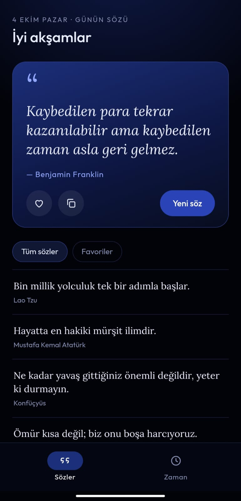
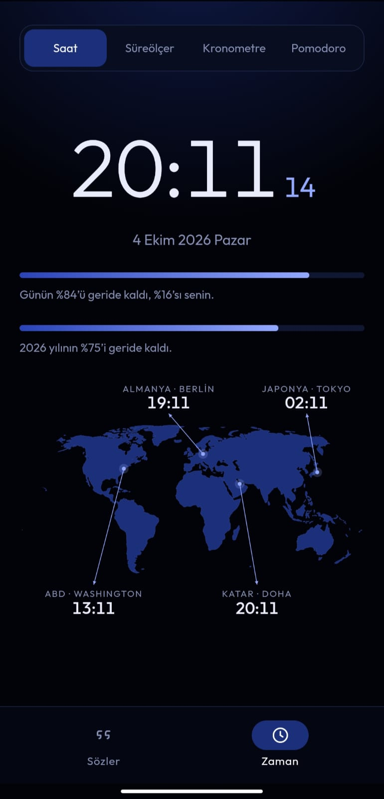

# Quotes Clock

<p align="center"></p>

Motive edici sözler ile saat, süreölçer, kronometre ve ayarlanabilir pomodoroyu iki sekmede birleştiren siyah-lacivert uygulama.


## Ekran görüntüleri

<p>
  
  
</p>


## İçerik
- `index.html` — uygulamanın kendisi (tek dosya; tarayıcıda açınca çalışır)
- `fonts/` — uygulamanın kullandığı yazı tipleri (Outfit, Lora — SIL Open Font License)
- `android/` — APK'yı oluşturan Android kabuğu (WebView): manifest, kaynaklar, `MainActivity.smali`

## Özellikler
- Günün sözü, söz listesi, favoriler
- Saat, gün ve yıl ilerleme çubukları, dünya saatleri haritası (Washington, Berlin, Doha, Tokyo)
- Süreölçer, tur kayıtlı kronometre, süreleri ayarlanabilen pomodoro
- Süre bitiminde sesli uyarı; tamamen çevrimdışı çalışır

## APK'yı derleme
`android/` klasörüne `assets/` adıyla `index.html` ve `fonts/` kopyalanır, ardından:

```
java -jar apktool.jar b android -o unsigned.apk
java -jar uber-apk-signer.jar -a unsigned.apk -o out
```

Hazır APK, Releases bölümündedir. Android 8.0 ve üzeri gerekir.
